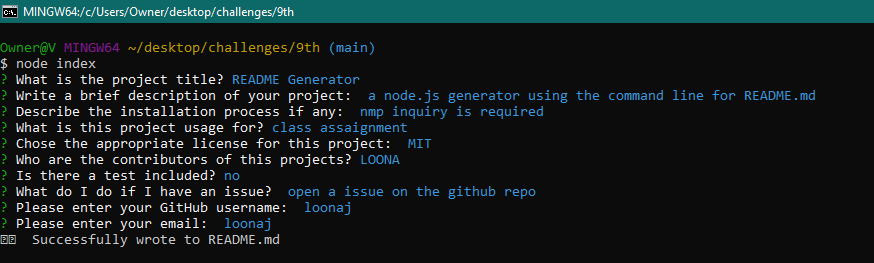
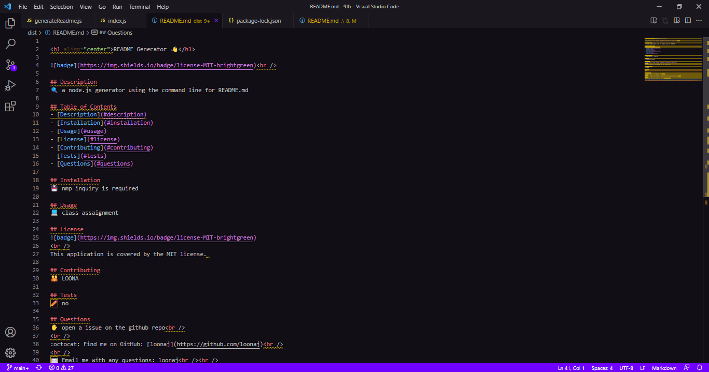

<h1 align="center">README.md Generator Using Node.js 👋</h1>

## Description
  
🔍 A node.js application that uses user input from inquirer to populate a README.md file for user repository.

Screenshots of the application 



## User Story
```
AS A developer
I WANT a README generator
SO THAT can quickly create a professional README for a new project 
```

## Installation
💾   
  
`npm init`
  
`npm install inquirer`

## Usage
💻   
  
Run the following command at the root of your project and answer the prompted questions:
  
`node index.js`
